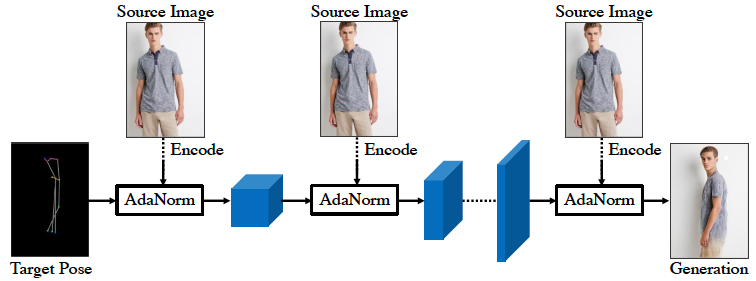
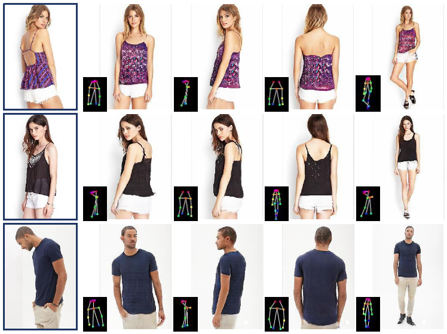

# PoseStylizer
PyTorch implementation of  "**Generating Person Images with Appearance-aware Pose Stylizer**" published in **IJCAI 2020** [\[paper\]](https://siyuhuang.github.io/papers/IJCAI-2020-Generating%20Person%20Images%20with%20Appearance-aware%20Pose%20Stylizer.pdf). 

```
@inproceedings{huang2020generating,
  title={Generating Person Images with Appearance-aware Pose Stylizer},
  author={Huang, Siyu and Xiong, Haoyi and Cheng, Zhi-Qi and Wang, Qingzhong 
          and Zhou, Xingran and Wen, Bihan and Huan, Jun and Dou Dejing},
  booktitle={IJCAI},
  year={2020}
}
```

The code is written by Dr. [Siyu Huang](https://siyuhuang.github.io/). Contact [Siyu Huang](https://siyuhuang.github.io/) for questions on this project.

<p align="center"></p>

<p align="center"></p>


## Getting Started
### Requirement
* Python3
* PyTorch 1.0.1

### Installation
- Clone this repo:
```bash
git clone https://github.com/siyuhuang/PoseStylizer.git
cd PoseStylizer
```

### Data Preperation
1. Download the Market-1501 dataset ```dataset/market_data.zip``` and the DeepFashion dataset ```dataset/fashion_data.zip``` from [Google Drive](https://drive.google.com/open?id=13EzWg6tW8a_DBabBbzCgTFuBqiuHahnu) / [Baidu Disk](https://pan.baidu.com/s/1PwO5yFhonDTtWdPLGgPrRw) (Password: jl0s).  The zip files include images ```/train``` ```/test```, keypoint annotations ```annotation.csv```, and pose transfer pairs ```pairs.csv```.
```bash
cd dataset
unzip market_data.zip
unzip fashion_data.zip
cd ..
```
2. Generate the pose heatmaps. Note, the disk space of generated heatmaps are extremely large (~18GB for Market-1501 and ~160GB for DeepFashion).
```bash
python tool/generate_pose_map_market.py
python tool/generate_pose_map_fashion.py
```

## Test with Pretrained Models

Download our pretrained checkpoints from [Google Drive](https://drive.google.com/open?id=1LKFYZvwizRpDxslWoyUePC9XG0cpqLzT) / [Baidu Disk](https://pan.baidu.com/s/1PwO5yFhonDTtWdPLGgPrRw) (Password: jl0s). 
* **Market-1501**

```bash
bash test_market.sh
```

* **DeepFashion**

```bash
bash test_fashion.sh
```


## Training
* **Market-1501**
```bash
bash train_market.sh
```

* **DeepFashion**
```bash
bash train_fashion.sh
```
**Note:** We use 8 GPUs for training by default. If you have less GPUs, change ```--gpu_ids``` and ```--batchSize``` accordingly. The results are competitive to the results in our paper.

## Evaluation

### SSIM, IS, L1, mask-SSIM, mask-IS, mask-L1

* *Tensorflow 1.14.1 (Python3)* is required. 

* **Market-1501**
```bash
python tool/getMetrics_market.py
```

* **DeepFashion**
```bash
python tool/getMetrics_fashion.py
```


### PCKh
* Download OpenPose pose estimator from [Google Drive](https://drive.google.com/open?id=1nqZ8xSXBXdL1F3WFHTJJwm4rXYCCVy0y) / [Baidu Disk](https://pan.baidu.com/s/1PwO5yFhonDTtWdPLGgPrRw) (Password: jl0s). Put ``
pose_estimator.h5`` under the root folder ``PoseStylizer``.
* *Tensorflow 1.14.1 (Python2)* is required. 
1. **Crop generated images from ```/results``` folder.**
```bash
python tool/crop_market.py
```
&nbsp; &nbsp; or
```bash
python tool/crop_fashion.py
```
2. **Compute keypoints coordinates.** Change the paths ``input_folder``  and ``output_path`` in ``tool/compute_coordinates.py``. 
```bash
python2 tool/compute_coordinates.py
```
3. **Compute PCKh score.**
```bash
python tool/calPCKH_market.py
```
&nbsp; &nbsp; or
```bash
python tool/calPCKH_fashion.py
```


## Acknowledgments
The code is written based on [pytorch-CycleGAN-and-pix2pix](https://github.com/junyanz/pytorch-CycleGAN-and-pix2pix) and [Pose-Transfer](https://github.com/tengteng95/Pose-Transfer).
